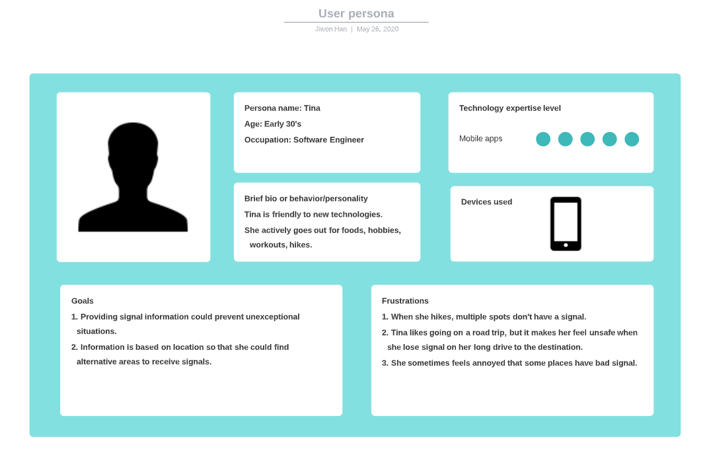
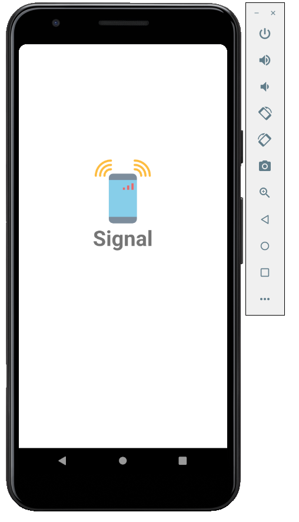
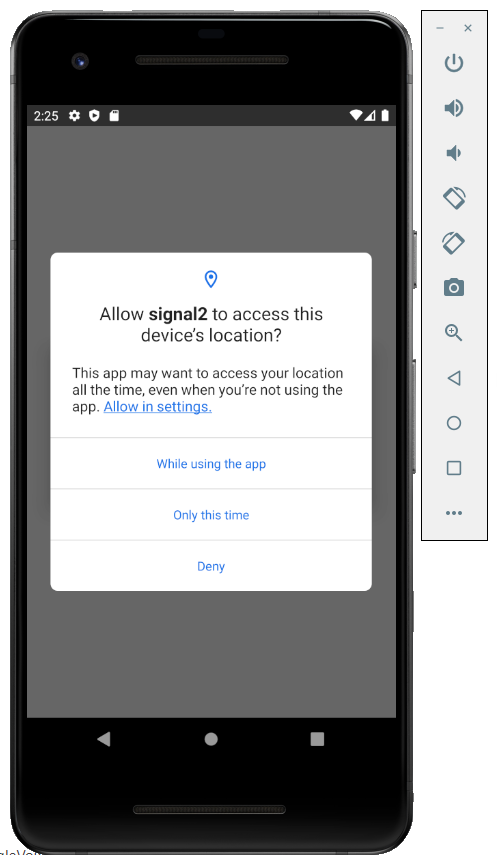
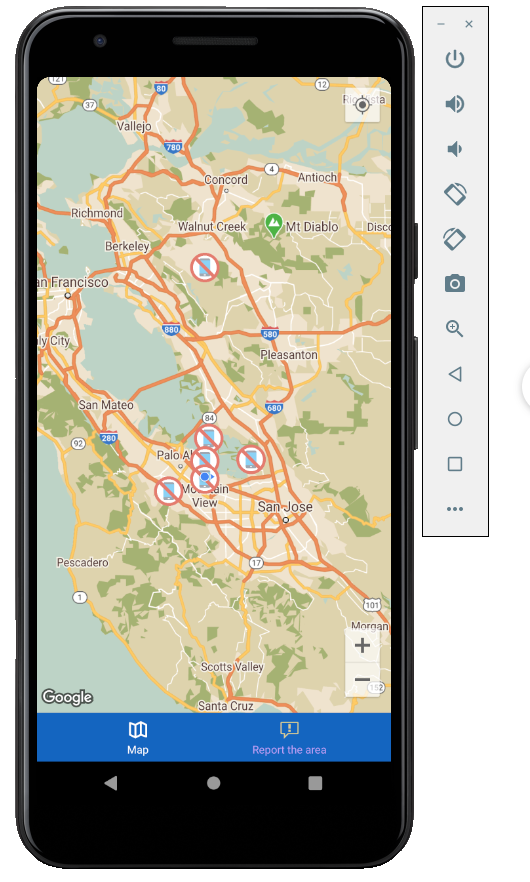
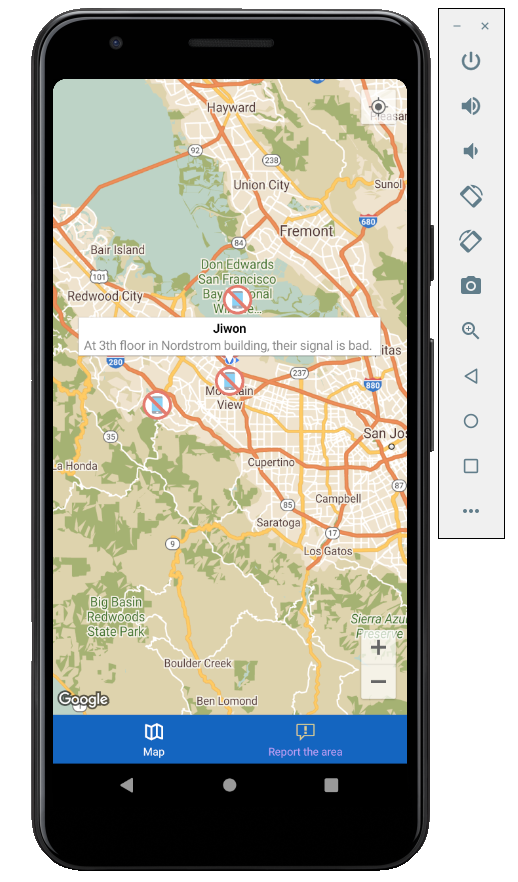
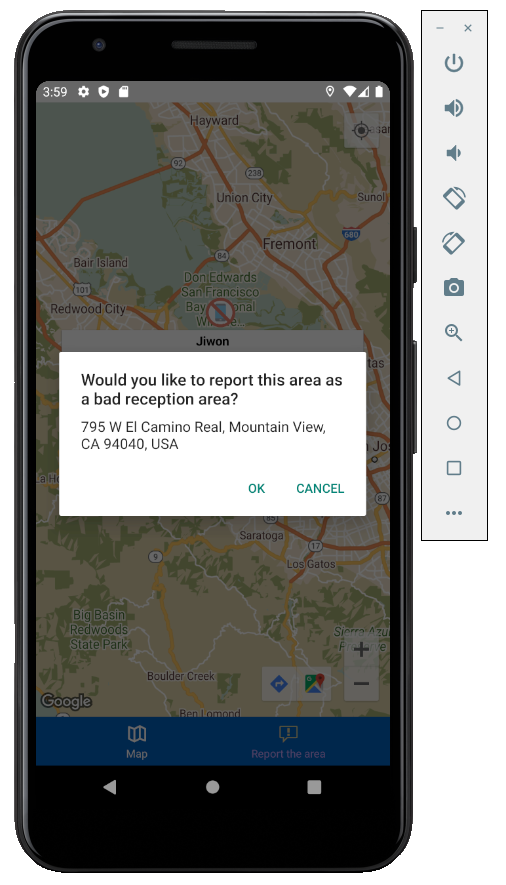
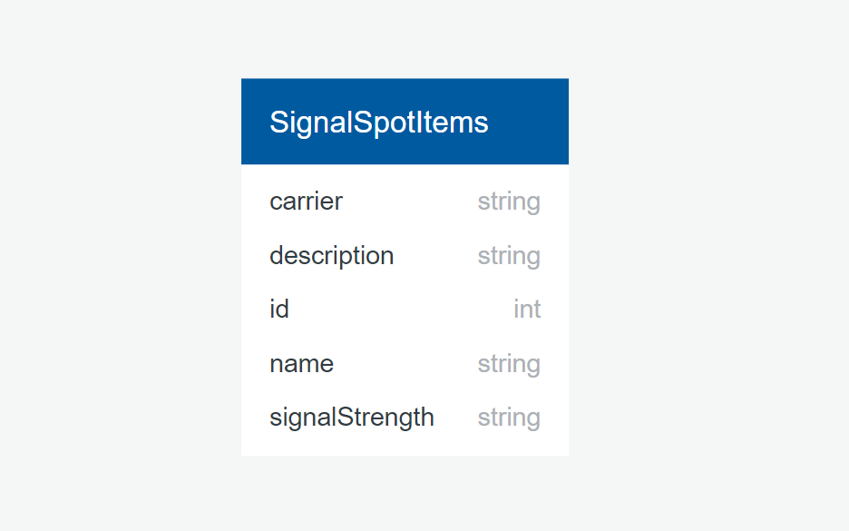
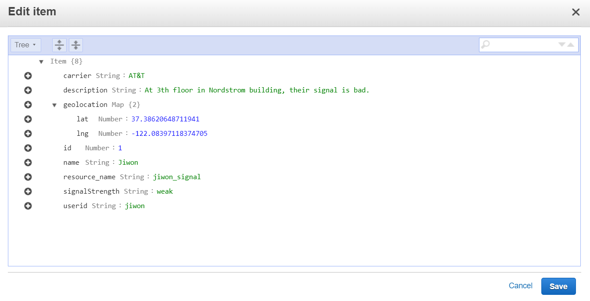

# Signal :signal_strength:

#### A signal information sharing mobile application, Lastest updated: 5/25/2020

#### By Jiwon Han

[](https://www.repostatus.org/#wip)


[](https://lbesson.mit-license.org/)
<a href="http://www.linkedin.com/in/jiwon1han">
  
</a>

## 1. Description

Signal is an Android mobile application that shares locations where they have non-reception or bad-reception.
<br/>
Signal will provide the platform that people share the bad/non-reception area information. A user is able to report the reception information on the Signal app. Based on information, users could prepare before having an unexpected reception issue. Users also could find the secret service spots in the non-reception area.

## 2. User Persona & flow

### User Persona



### User Flow

1. A user could see the icon of Signal when entering an app.
2. The User is given a location permission option that requiring to choose out of `While using the app`, `Only this time` or `Deny`.
The user selects `While using the app` or `Only this time`.
3. The map is loaded based on the current user's location. 
4. The User could see `bad reception` icon where other users have reported the area as a bad or non-reception area.
5. There are footer navigation that routes to the Map(main) and the Report.
6. When the user press a Report at the footer navigation, `select area` alert pops up.
7. The user press and hold the location and reporting confirmation alert pops up.
8. The address of the chosen area is provided.
9. The user clicks `Ok` and navigates to a Form page.
10. The user is able to fill out the form: name, description, signal strength(none, weak, okay, good) and carrier(AT&T, Tmobile, Verizon). Location information(latitude and longitude) is automatically delivered to the server.
11. User is able to see a new signal icon that was added by the user.

### ScreenShots

 





## 3. Development

### What's included in react-native 

```bash 
|-- src
|   |-- actions
|   |-- -- actions.js
|   |-- -- fetchData.js
|   |-- -- latlngReserse.js
|   |-- components
|   |-- -- Loading.js
|   |-- middleware
|   |-- -- middleware-logger.js
|   |-- navigation
|   |-- -- Main.js
|   |-- reducers
|   |-- -- reducers.js
|   |-- screens
|   |-- -- Form.js
|   |-- -- Map.js
|   |-- style
|   |-- -- mapStyle.js
```

### Tech stack:
+ [NPM](https://www.npmjs.com/) for package management
+ [React Native](https://reactnative.dev/) as core stack
+ [Redux](https://redux.js.org/) for state management 
+ [ASP .NET](https://dotnet.microsoft.com/apps/aspnet) for backend API
+ [AWS Lambda](https://aws.amazon.com/lambda/) for serverless compute
+ [AWS Dynamo Db](https://aws.amazon.com/dynamodb/?trk=ps_a131L000005OdsxQAC&trkCampaign=PAC_DynamoDB_webpage_Augustupdates&sc_channel=ps&sc_campaign=PAC_paas_Q4_10_2018_DynamoDB_paidsearch_google_ad1P&sc_outcome=PaaS_Digital_Marketing&sc_geo=NAMER&sc_country=US&sc_publisher=Google&sc_medium=PAC-PaaS-R|PS-GO|Brand|Desktop|PA|Database|DynamoDB|US|EN|Text&s_kwcid=AL!4422!3!385698010926!e!!g!!dynamo%20db&ef_id=Cj0KCQjwzZj2BRDVARIsABs3l9K_tm-ESyV8vyzijV5ZXgZQ_TfNnekg0ECpKDAJXnbuvbgmzanv9GEaAt8WEALw_wcB:G:s&s_kwcid=AL!4422!3!385698010926!e!!g!!dynamo%20db) for cloud database
+ [Google Map API](https://developers.google.com/maps/documentation/android-sdk/intro?_gac=1.227754479.1590393377.CjwKCAjw2a32BRBXEiwAUcugiLwc9bGdd9v948Vbj1mOWXbgksZUWcL3cPaQ_V1Pev3uVtXQGYHulxoCZtcQAvD_BwE&_ga=2.6196275.1602237402.1590393361-222622481.1589216034)
+ [Geolocation API](https://developers.google.com/maps/documentation/geolocation/intro) 

**_Backend API is uploaded at https://github.com/jiwon-seattle/Signal-Api.git_** 

To run dev mode locally, be sure that `Android emulator` is installed and running. Please insert your Google Geolocation API at API_KEY section in latlngReserse.js[src/actions/latlngReserse.js]. 

```bash
  $ git clone https://github.com/jiwon-seattle/Signal.git 
  $ cd SignalReactNative
  # After successful pkg installtion
  $ npm install
  $ react-native run-android
```
> **If you receive an error about `Error:Execution failed for task ':app:processDebugResources'`, please run following : `cd android && ./gradlew clean`.

### API Documentation

- Base url: https://phm16m4tck.execute-api.us-west-2.amazonaws.com/Prod 
- View all API endpoints [API Endpoints](#api-endpoints) below.

#### API Endpoints

<details>
  <summary>SignalSpotItems</summary>

| Action for ITEMS                 | Method | Endpoint          | Query Parameters | Raw JSON Body Input |
| :------------------------------- | :----- | :---------------- | :--------------- | :------------------ |
| List all signal spot items       | GET    | /api/signalspots  | string name, int page, int size | N/A |
| Create new signal spot           | POST   | /api/signalspots  | N/A | { "ItemName": "[item name]" } |
| Edit item                        | PUT    | /api/signalspots  | N/A | { "ItemName": "[edited item name]" } |
| Delete item                      | DELETE | /api/signalspots  | N/A | N/A |
| Get one item                     | GET    | /api/signalspots/{id}/{name}   | N/A | N/A |

</details>

### Database





### Future Additional Features

* Sign-In and sign-out 
* User authentication (database, Facebook, Google)
* Notification as when a user gets close to the non-reception area
* Dynamic navigation and setting page
* Location or carrier search function 
* Query data per distance from users

## 3. Known Bugs

1. After the report is submitted, no reset for previous information

## 4. Support and contact details

Any feedback is appreciated! Please contact at email: jiwon1.han@gmail.com

### License

*This software is licensed under the MIT license*

Copyright (c) 2020 **_Jiwon Han_**
